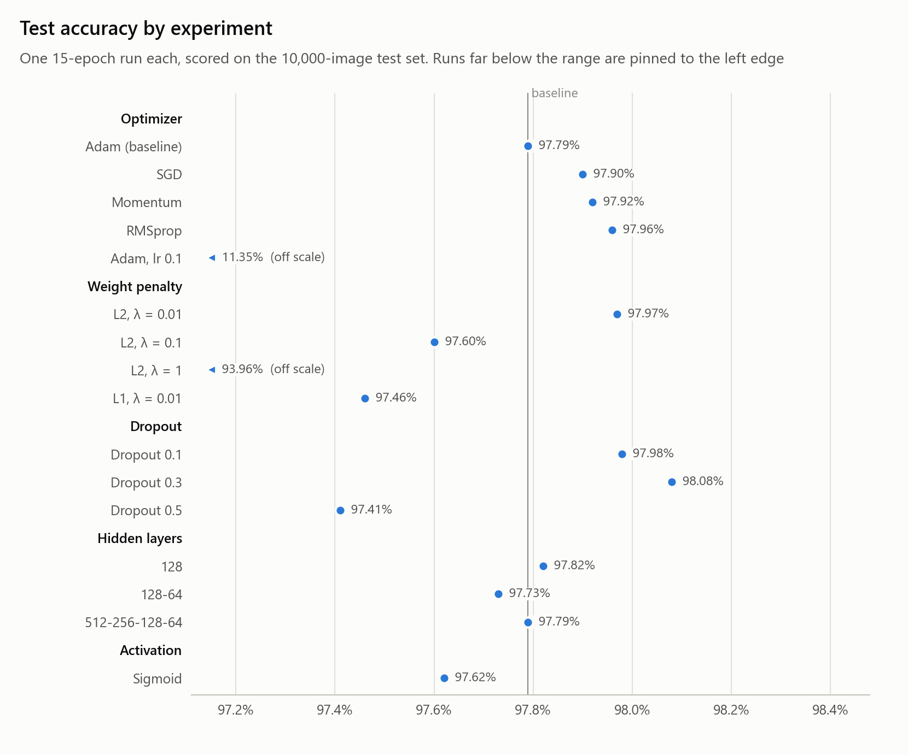
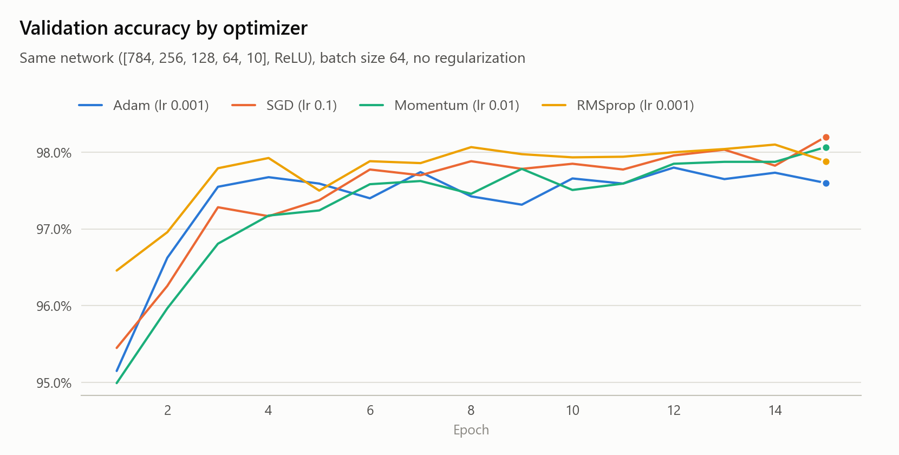
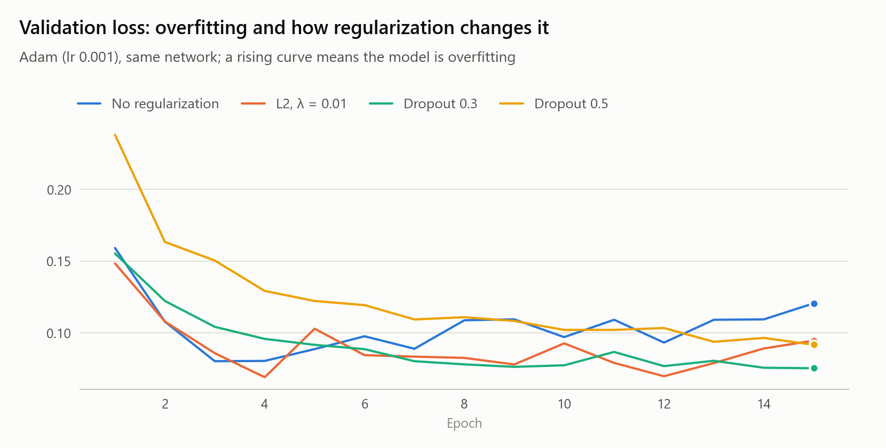
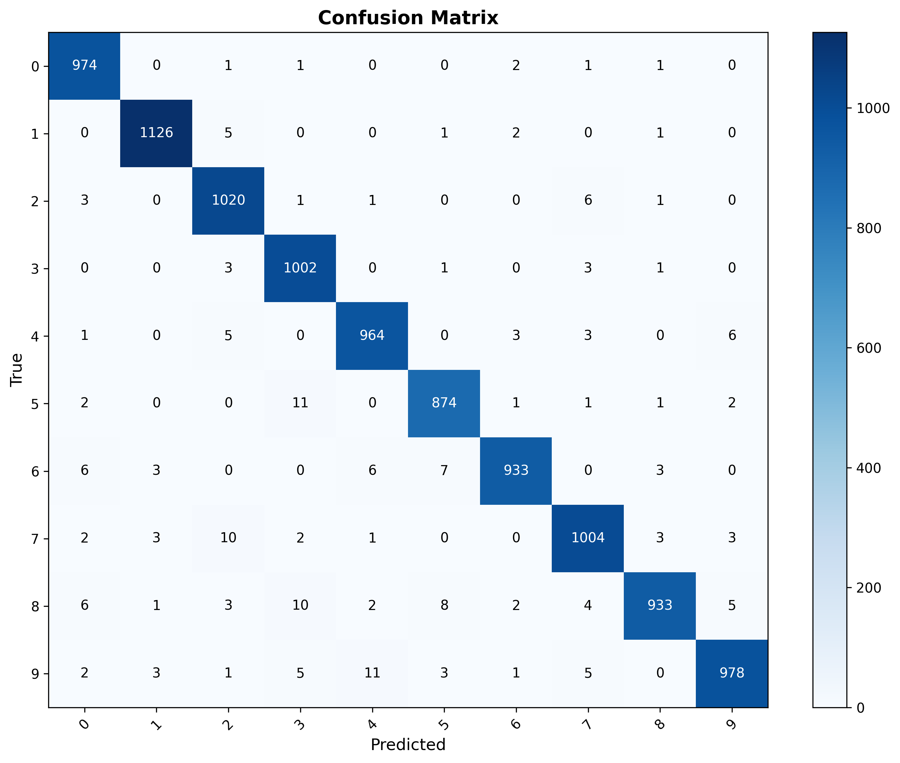

# Neural Network from Scratch for MNIST

A fully connected neural network written in plain NumPy (no deep-learning framework), with configurable depth, four optimizers, L1/L2 penalties, dropout and per-run experiment tracking.

**Best result: 98.08% test accuracy** with Adam (lr 0.001), hidden layers 256-128-64 (ReLU), dropout 0.3 and 15 epochs.

<picture>
  <source media="(prefers-color-scheme: dark)" srcset="docs/figures/test_accuracy-dark.png">
  
</picture>

## Quick start

```bash
python -m venv .venv
.venv\Scripts\activate          # Windows (macOS/Linux: source .venv/bin/activate)
pip install -r requirements.txt

python main.py                  # train one model with configs/config.py
python run_experiments.py       # reproduce every result below
python run_experiments.py dropout_0.3   # retrain only the best model
python make_figures.py          # rebuild the README figures
```

Each run writes `experiments/<name>/`: `config.json`, per-epoch `metrics.csv`, `summary.json`, training-curve and confusion-matrix plots, and the best-validation weights (`models/final_model.pkl`, not tracked in git).

## What's implemented

| Part | Details |
|---|---|
| Network | Any list of layer sizes, ReLU or sigmoid hidden layers, softmax output, He or Xavier initialization |
| Training | Mini-batch gradient descent, reshuffled every epoch; the weights from the best validation epoch are kept |
| Optimizers | SGD, Momentum, RMSprop, Adam (with bias correction) |
| Regularization | L2, L1 and elastic net (penalty divided by the batch size, `λ/2m · ΣW²` for L2); inverted dropout with optional rate schedules |
| Data | MNIST split into 48,000 train / 12,000 validation / 10,000 test, pixels scaled to [0, 1] |

Backpropagation is checked against numerical gradients.

## Results

Every run uses 15 epochs, batch size 64, seed 42 and the baseline setup (Adam at lr 0.001, hidden layers 256-128-64, ReLU, no regularization) except for the one thing it changes. Test accuracy is measured with the weights from the best validation epoch.

<picture>
  <source media="(prefers-color-scheme: dark)" srcset="docs/figures/optimizers-dark.png">
  
</picture>

<picture>
  <source media="(prefers-color-scheme: dark)" srcset="docs/figures/overfitting-dark.png">
  
</picture>

**Takeaways**

- **Optimizer choice barely matters at sensible learning rates.** All four end within 0.2% of each other. Adam and RMSprop are near their best after 3 epochs and then start to overfit, while SGD and Momentum keep improving slowly.
- **The learning rate matters more.** Adam at lr 0.1 never learns: 11.35%, which is chance level for 10 classes.
- **Every unregularized model overfits.** Training accuracy reaches 99.4–100% while validation stays around 97.6–98.2%. Without regularization, Adam's validation loss is lowest at epoch 3 and rises after that. Keeping the best-validation weights protects the test score.
- **Dropout 0.3 works best (98.08%).** It was one of only two runs (the other is dropout 0.5) whose validation loss was still falling at epoch 15, so it would likely gain from more epochs. Light L2 (λ = 0.01) scores slightly above the baseline (97.97% vs 97.79%). Stronger penalties narrow the train/validation gap but cost accuracy, and L2 at λ = 1 underfits (93.96%).
- **Bigger isn't better here.** One hidden layer of 128 units (97.82%) matches the four-layer networks. The largest network peaks at epoch 5 and then overfits.
- **ReLU beats sigmoid** (97.79% vs 97.62%) and learns faster: it reaches 97% validation accuracy at epoch 3, against epoch 6 for sigmoid.

Each configuration was run once, so differences of a few tenths of a percent may not hold with other seeds.

<details>
<summary>Full results table</summary>

| Experiment | Change from baseline | Test acc | Best val acc (epoch) | Train − val gap at epoch 15 |
|---|---|---|---|---|
| `opt_adam` | baseline | 97.79% | 97.80% (12) | 1.79% |
| `opt_sgd` | SGD, lr 0.1 | 97.90% | 98.20% (15) | 1.79% |
| `opt_momentum` | Momentum, lr 0.01 | 97.92% | 98.07% (15) | 1.92% |
| `opt_rmsprop` | RMSprop, lr 0.001 | 97.96% | 98.10% (14) | 1.76% |
| `opt_adam_lr0.1` | Adam, lr 0.1 | 11.35% | 11.02% (2) | diverged |
| `reg_l2_0.01` | L2, λ = 0.01 | 97.97% | 98.15% (12) | 1.82% |
| `reg_l2_0.1` | L2, λ = 0.1 | 97.60% | 97.58% (12) | 1.03% |
| `reg_l2_1` | L2, λ = 1 | 93.96% | 94.17% (11) | 0.24% |
| `reg_l1_0.01` | L1, λ = 0.01 | 97.46% | 97.43% (9) | 1.10% |
| `dropout_0.1` | dropout 0.1 | 97.98% | 98.17% (12) | 1.65% |
| `dropout_0.3` | dropout 0.3 | **98.08%** | 97.98% (15) | 1.55% |
| `dropout_0.5` | dropout 0.5 | 97.41% | 97.65% (15) | 1.20% |
| `arch_128` | hidden layers 128 | 97.82% | 97.76% (14) | 2.09% |
| `arch_128_64` | hidden layers 128-64 | 97.73% | 97.89% (13) | 1.98% |
| `arch_512_256_128_64` | hidden layers 512-256-128-64 | 97.79% | 98.05% (5) | 1.69% |
| `act_sigmoid` | sigmoid, Xavier init | 97.62% | 97.79% (14) | 2.11% |

</details>

**Best model's confusion matrix** (`dropout_0.3`, test set). The most common mistakes are 5→3, 9→4, 7→2 and 8→3, with 10–11 errors each.



## Configuration

Everything is set in [`configs/config.py`](configs/config.py); the experiment name is set at the top of [`main.py`](main.py).

```python
CONFIG = {
    "seed": 42,
    "learning_rate": 0.001,
    "epochs": 15,
    "batch_size": 64,
    "architecture": [784, 256, 128, 64, 10],
    "activation": "relu",                 # "relu" or "sigmoid"
    "weight_initialization": "he",        # "he" or "xavier"
    "optimizer": "adam",                  # "sgd", "momentum", "rmsprop", "adam"
    "regularization_type": "none",        # "none", "l2", "l1", "elastic_net"
    "lambda_reg": 0.01,
    "use_dropout": False,
    "dropout_rate": 0.5,
    "dropout_schedule": "constant",       # "constant", "linear", "exponential", "step"
    # plus optimizer_params (momentum, decay_rate, beta1, beta2, epsilon) and l1_ratio
}
```

## Project structure

```
main.py               train one model
run_experiments.py    experiment suite + results table (--table)
make_figures.py       README figures -> docs/figures/
configs/config.py     configuration
src/
  core/               network (forward/backward), activations, loss, regularization + dropout
  optimizers/         SGD, Momentum, RMSprop, Adam
  training/           mini-batch training loop
  evaluation/         accuracy, confusion matrix, precision/recall/F1
  utils/              data loading, logging, experiment folders, plots, seeding
experiments/          one folder per run
```

## Next work

- [ ] **Phase 1: Forward-Forward classification.** Add Hinton's Forward-Forward (FF) algorithm for classification.
- [ ] **Phase 2: Forward-Forward regression.** Reproduce FFR (Forward-Forward for Regression; Liu et al., 2026) on one tabular dataset, with variance across runs.
- [ ] **Phase 3: Low-bit quantization.** Test an open question that the FFR authors list as a limitation: how layer-local training behaves under low-bit weight quantization.

**Author:** Essid Salem
